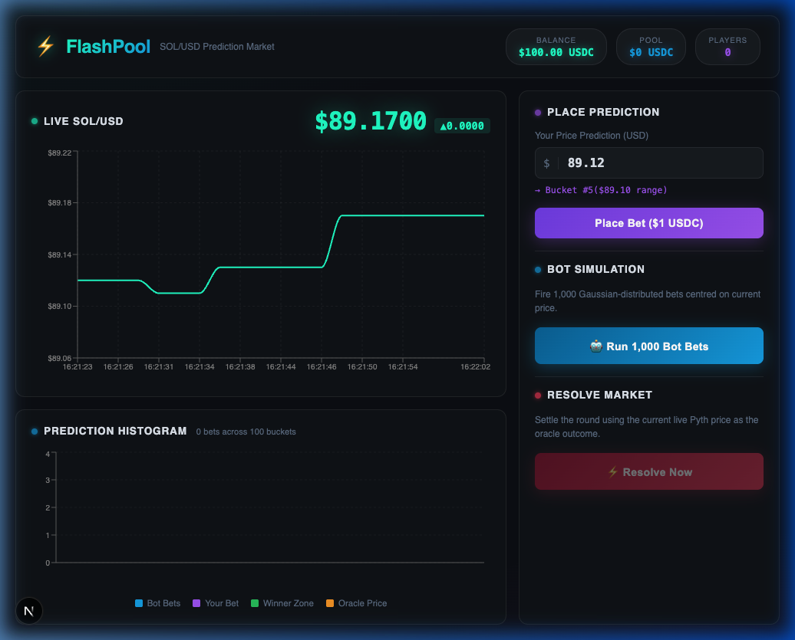
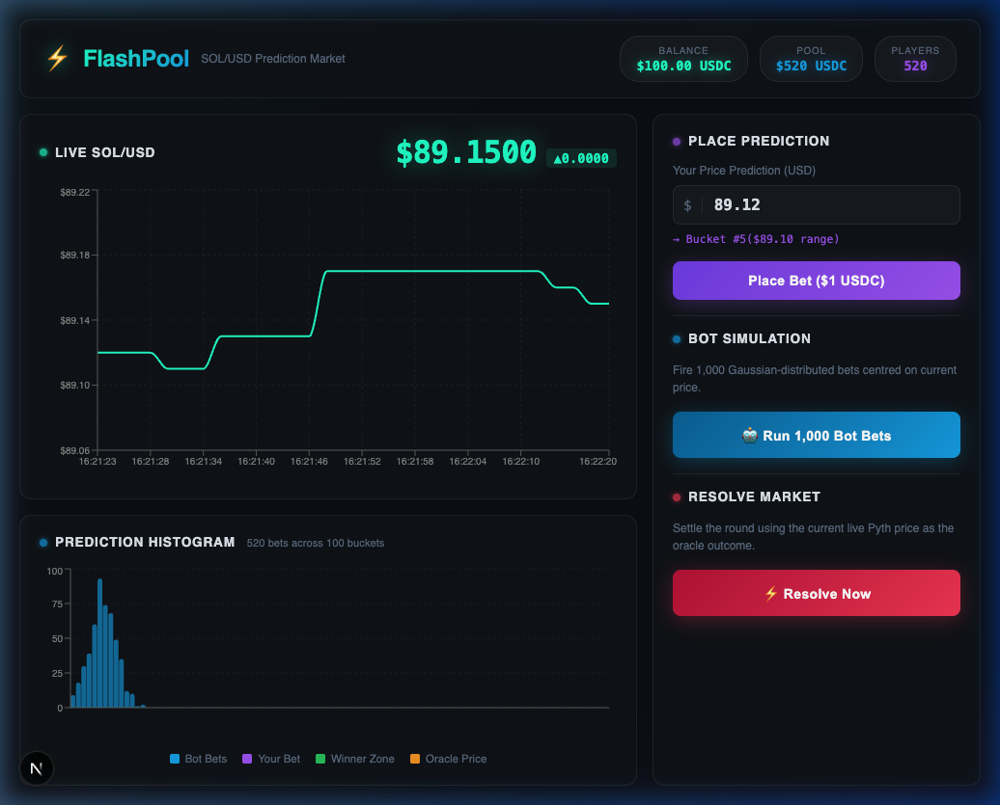
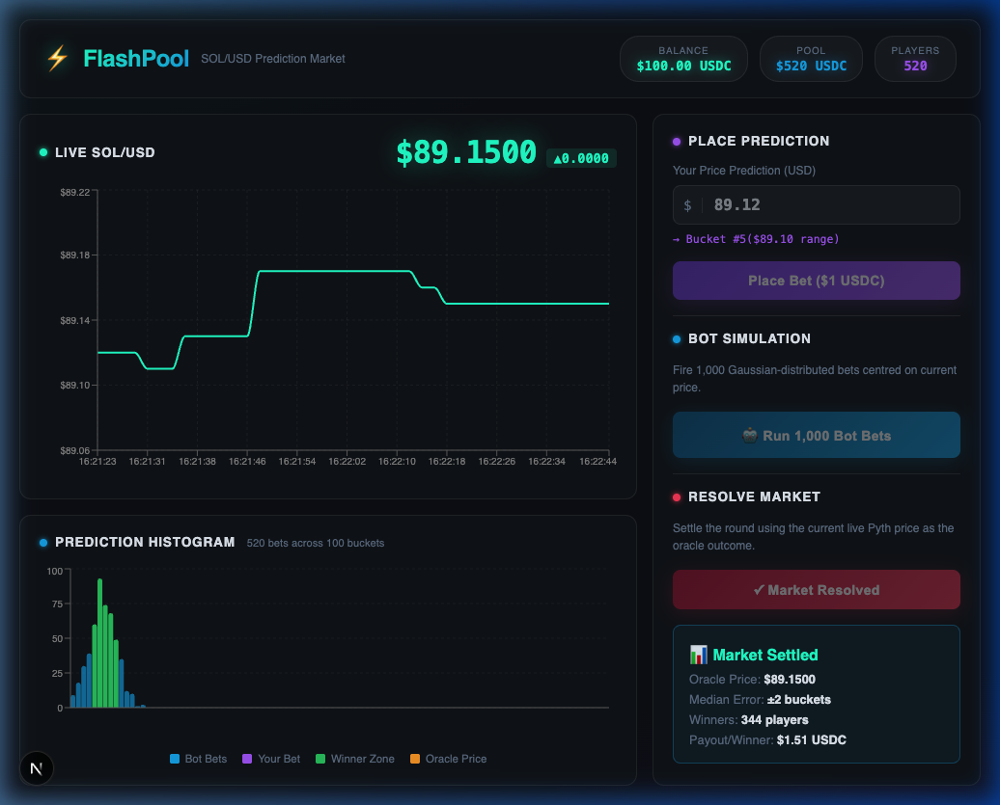

# ⚡ FlashPool — SOL/USD Prediction Market

> A high-performance, accuracy-based prediction market built on Solana using Anchor. Powered by Pyth Lazer oracle data and designed for MagicBlock Ephemeral Rollups.

[](https://www.rust-lang.org)
[](https://anchor-lang.com)
[](https://nextjs.org)
[](https://opensource.org/licenses/MIT)

---

## 📖 Table of Contents

1. [What is FlashPool?](#-what-is-flashpool)
2. [Live Demo Screenshots](#-live-demo-screenshots)
3. [Architecture Overview](#-architecture-overview)
4. [The Key Innovation: O(1) Histogram](#-the-key-innovation-o1-histogram)
5. [On-Chain Program](#-on-chain-program)
   - [State Design](#state-design)
   - [Instructions](#instructions)
   - [Security Model](#security-model)
6. [Phase 2: Oracle Integration (No SDK Conflict)](#-phase-2-oracle-integration-no-sdk-conflict)
   - [Why No pyth-sdk-solana](#why-no-pyth-sdk-solana)
   - [Manual Byte Parsing](#manual-byte-parsing)
   - [3 Security Checks](#3-security-checks)
7. [Frontend](#-frontend)
   - [Live Price Chart](#live-price-chart)
   - [1000-Bot Simulation](#1000-bot-simulation)
   - [Market Resolution](#market-resolution)
8. [Test Suite](#-test-suite)
   - [10,000-User Stress Test](#10000-user-stress-test)
   - [LiteSVM Mock Oracle](#litesvm-mock-oracle)
9. [Project Structure](#-project-structure)
10. [Running Locally](#-running-locally)
11. [MagicBlock Ephemeral Rollup Roadmap](#-magicblock-ephemeral-rollup-roadmap)
12. [Why Every Design Decision Was Made](#-why-every-design-decision-was-made)

---

## 🎯 What is FlashPool?

FlashPool is a **prediction market** where users predict the future price of SOL/USD and earn rewards proportional to their accuracy. Unlike binary prediction markets (just "up" or "down"), FlashPool uses a **100-bucket histogram** to reward users based on *how close* their prediction was to the actual oracle price.

**The core loop:**
1. Pool opens → users place price predictions (cost: 1 USDC)
2. A Pyth oracle price is read on-chain at resolution time
3. The program calculates which bucket won, then walks outward to find the "median error" — the distance needed to cover 50% of participants
4. Any user within `median_error` buckets of the actual price wins an equal share of the pool

---

## 📸 Live Demo Screenshots

### Initial State — Real Pyth Price Feed
The UI fetches live SOL/USD from Pyth Hermes every 2 seconds the moment you open the page.



### 1,000 Bot Bets — Gaussian Distribution
Click "Run 1,000 Bot Bets" to see the histogram fill with a realistic Gaussian bell curve centred on the current price (simulating real user behaviour).



### Market Resolved — Winner Zone Highlighted
Click "Resolve Now" to settle the market. The green zone shows winners, the oracle price is overlaid, and the payout per winner is calculated instantly using the O(1) histogram loop.



---

## 🏗️ Architecture Overview

```
┌─────────────────────────────────────────────────────────┐
│                    FlashPool System                     │
│                                                         │
│  ┌────────────┐    ┌──────────────────────────────┐    │
│  │  Frontend  │    │   Solana Program (Anchor)    │    │
│  │  Next.js   │───▶│                              │    │
│  │            │    │  initialize_pool             │    │
│  │ Live Chart │    │  place_prediction            │    │
│  │ Histogram  │    │  resolve_market ◀── Pyth     │    │
│  │ Bot Sim    │    │  claim_reward                │    │
│  └────────────┘    └──────────┬───────────────────┘    │
│                               │                         │
│  ┌────────────────────────────▼───────────────────┐    │
│  │              Account State                     │    │
│  │                                                │    │
│  │  FlashPool PDA       UserPrediction PDA        │    │
│  │  ├ histogram[100]    ├ predicted_bucket_index  │    │
│  │  ├ total_pool        ├ user: Pubkey            │    │
│  │  ├ median_error      └ bump                    │    │
│  │  ├ outcome                                     │    │
│  │  └ oracle_feed       Vault PDA (Token-2022)    │    │
│  └────────────────────────────────────────────────┘    │
└─────────────────────────────────────────────────────────┘
```

---

## 🔢 The Key Innovation: O(1) Histogram

Most prediction markets store individual bets in a dynamic array. This creates **O(N) resolution cost** — resolving 10,000 bets requires 10,000 account reads.

FlashPool stores a **fixed `[u32; 100]` histogram** on the `FlashPool` PDA. Regardless of whether 10 or 10,000 users join, the account size never changes and resolution always costs the same.

### Bucket Math (place_prediction)

```rust
// User predicts $951.60, base_price = $950.00, precision_step = $0.10

let bucket_index = if prediction_value < flash_pool.base_price {
    0usize  // below range → clamp to bucket 0
} else {
    let diff = prediction_value - flash_pool.base_price;
    //   diff = 95160 - 95000 = 160 (in 2-decimal integer units)
    let idx = (diff / flash_pool.precision_step) as usize;
    //   idx  = 160 / 10 = 16 → Bucket 16
    if idx >= HISTOGRAM_BUCKETS { HISTOGRAM_BUCKETS - 1 } else { idx }
};

// The histogram just gets a +1 at that bucket:
flash_pool.histogram_buckets[bucket_index] += 1;
```

**Why this matters:** The histogram counter update is a single array write — **O(1)** per user entry.

### Median Error Calculation (resolve_market)

```
Oracle price lands in bucket 16 (winning bucket).
Target = ceil(total_participants / 2) = 500 (for 1000 users).

Distance 0: bucket[16]          → acc = 95
Distance 1: bucket[15]+bucket[17] → acc = 95 + 87 + 92 = 274
Distance 2: bucket[14]+bucket[18] → acc = 274 + 70 + 75 = 419
Distance 3: bucket[13]+bucket[19] → acc = 419 + 55 + 60 = 534 ≥ 500 → STOP

median_error = 3 buckets (= ±$0.30)

Winners: anyone in buckets 13-19 (within $0.30 of oracle price)
```

This loop always runs **at most 100 iterations** — O(1) regardless of participant count.

---

## 🛠️ On-Chain Program

### State Design

```rust
// programs/flash_pool/src/state.rs

#[account]
#[derive(InitSpace)]
pub struct FlashPool {
    pub oracle_feed:        Pubkey,      // The Pyth price feed this pool tracks
    pub base_price:         u64,         // Lowest bucket price (e.g. 95000 = $950.00)
    pub precision_step:     u64,         // Width of each bucket (e.g. 10 = $0.10)
    pub entry_fee:          u64,         // Cost to enter (e.g. 1_000_000 = 1 USDC)
    pub total_participants: u32,         // Number of bets placed
    pub total_pool_amount:  u64,         // Total USDC collected in vault
    pub histogram_buckets:  [u32; 100], // The core data structure — O(1) resolution
    pub outcome:            u64,         // Oracle price at resolution time
    pub median_error:       u64,         // Distance to 50th percentile (in buckets)
    pub bump:               u8,
}

// Why Box<Account<..>> in claim_reward?
// Solana has a 4KB STACK limit. FlashPool with its [u32; 100] array
// is too large to live on the stack. Box<> moves it to the HEAP.
pub struct ClaimReward<'info> {
    pub flash_pool: Box<Account<'info, FlashPool>>, // heap-allocated
    ...
}
```

**Why `InitSpace`?** Anchor's `#[derive(InitSpace)]` automatically computes the exact bytes needed for the PDA so we never hardcode magic numbers like `8 + 32 + 8 + 8 + ... + (4 * 100)`. This eliminates a whole class of "account too small" bugs.

### Instructions

#### 1. `initialize_pool`

Sets up the market. Creates:
- A `FlashPool` PDA (seeds: `["flash_pool", oracle_feed]`) — stores the histogram state
- A `Vault` PDA (seeds: `["vault", flash_pool_key]`) — Token-2022 token account that holds user funds

```rust
pub fn initialize_pool(
    ctx: Context<InitializePool>,
    oracle_feed: Pubkey,    // The Pyth feed address this pool is locked to
    base_price: u64,        // Lower bound of bucket 0
    precision_step: u64,    // Width per bucket in 2-decimal units
) -> Result<()>
```

#### 2. `place_prediction`

User enters the pool. Under the hood:

```
1. Calculate bucket index from user's price prediction
2. Increment histogram_buckets[idx] by 1
3. Update total_participants and total_pool_amount
4. Create UserPrediction PDA (stores the user's bucket index)
5. CPI into Token-2022: transfer ENTRY_FEE from user → vault
```

**Why `transfer_checked`?**
```rust
// transfer_checked verifies the mint AND decimals at the CPI level.
// This prevents "fake token" attacks where someone passes a mint
// that looks like USDC but isn't.
transfer_checked(cpi_ctx, flash_pool.entry_fee, ctx.accounts.mint.decimals)?;
```

#### 3. `resolve_market`

Reads the live Pyth oracle price account (no argument needed — price is read on-chain), calculates the winning bucket and median error, and locks the pool.

#### 4. `claim_reward`

Winner calls this. The program:
1. Checks `predicted_bucket_index` is within `median_error` of the winning bucket
2. Transfers `total_pool / winner_count` USDC from vault to user
3. **Closes the `UserPrediction` PDA** and returns the rent to the user

Closing the PDA is important — it prevents users from claiming twice and reclaims rent (~0.002 SOL) which is returned to the user as an incentive to call this instruction.

### Security Model

| Risk | Mitigation |
|---|---|
| Double claim | `UserPrediction` PDA closed on first claim — second call fails with "account not found" |
| Wrong oracle | `oracle_feed` stored in `FlashPool`; oracle key must match on `resolve_market` |
| Fake token | `transfer_checked` verifies mint + decimals |
| Stack overflow | `Box<Account<FlashPool>>` in `ClaimReward` moves data to heap |
| Overflow in math | All arithmetic uses `checked_add` / `saturating_add` with custom `Overflow` error |

---

## 🔮 Phase 2: Oracle Integration (No SDK Conflict)

### Why No `pyth-sdk-solana`

The `pyth-sdk-solana` crate pulls in `anchor-lang v0.32.1` which uses **borsh 0.10**. Our program uses **Anchor 1.0** which uses **borsh 1.0**. These two borsh versions are ABI-incompatible — Rust cannot compile them together:

```
error[E0277]: the trait bound `PriceFeedMessage: BorshSerialize` is not satisfied
```

**Our solution:** Skip the SDK entirely. We manually decode the `PriceUpdateV2` account bytes at known, stable offsets.

### Manual Byte Parsing

The `PriceUpdateV2` account layout is derived from the SDK's own `LEN` constant:

```rust
// From pyth-solana-receiver-sdk/src/price_update.rs line 59:
pub const LEN: usize = 8 + 32 + 2 + 32 + 8 + 8 + 4 + 8 + 8 + 8 + 8 + 8;
//                     ↑    ↑    ↑    ↑    ↑    ↑    ↑    ↑    ↑    ↑    ↑    ↑
//                    disc  wrt  vl  fid  price conf exp  pbt ppbt  epr  epc  psl
```

Mapped to byte offsets:

```
[0  .. 8 ]  Anchor discriminator     (8 bytes)
[8  .. 40]  write_authority: Pubkey  (32 bytes)
[40 .. 42]  verification_level       (2 bytes: 1 tag + 1 num_signatures)
[42 .. 74]  feed_id: [u8; 32]        (32 bytes) ← we verify this is SOL/USD
[74 .. 82]  price: i64               (8 bytes)  ← the actual price
[82 .. 90]  conf: u64                (8 bytes)
[90 .. 94]  exponent: i32            (4 bytes)  ← scale factor
[94 .. 102] publish_time: i64        (8 bytes)  ← staleness check
```

```rust
// In resolve_market.rs — reading price with no external dependencies:
let data = ctx.accounts.price_update.try_borrow_data()?;

let raw_price = i64::from_le_bytes(data[74..82].try_into()?);
let exponent  = i32::from_le_bytes(data[90..94].try_into()?);
let publish_time = i64::from_le_bytes(data[94..102].try_into()?);

// Normalize to 2-decimal format: $89.15 → 8915
// raw_price = 8_915_000_000, exponent = -8
// scale = 10^(8-2) = 1_000_000
// oracle_price = 8_915_000_000 / 1_000_000 = 8_915
let scale = 10_u64.pow(exponent.unsigned_abs().saturating_sub(2));
let oracle_price = raw_price.unsigned_abs() / scale;
```

**Benefits:**
- Zero extra dependencies → faster `cargo build`
- No borsh conflicts — ever
- Binary size is smaller
- Tests don't need to deploy the full Pyth program into LiteSVM

### 3 Security Checks

```rust
// 1. OWNER CHECK — prevent fake account injection
require_keys_eq!(
    *ctx.accounts.price_update.owner,
    PYTH_RECEIVER_PROGRAM_ID,  // "rec5EKMGg6MxZYaMdyBfgwp4d5rB9T1VQH5pJv5LtFJ"
    ErrorCode::InvalidOracleOwner
);
// Why: without this, anyone could create an account they own, fill it with
// bytes saying "SOL = $0.01", and drain the pool.

// 2. FEED ID CHECK — prevent wrong asset
require!(feed_id == SOL_USD_FEED_ID, ErrorCode::MismatchedFeedId);
// Why: a valid BTC/USD PriceUpdateV2 account passes the owner check but
// would report a wildly different price, corrupting the market outcome.

// 3. STALENESS CHECK — prevent replaying old prices
let age = clock.unix_timestamp - publish_time;
require!(age <= MAX_PRICE_AGE_SECONDS, ErrorCode::StaleOracle);
// Why: prevents an attacker from saving an old oracle price from a
// previous slot and replaying it during a favourable market state.
```

### Connecting to MagicBlock Ephemeral Rollup

When deploying to MagicBlock ER, the contract code is **identical**. The difference is:
1. The `FlashPool` and `Vault` PDAs are *delegated* to the ER before the market opens
2. The `price_update` account address is derived from MagicBlock's chain-pusher:

```
seeds = ["price feed", "pyth-lazer", &FEED_ID]
program = PriCems5tHihc6UDXDjzjeawomAwBduWMGAi8ZUjppd
```

The MagicBlock chain-pusher writes fresh Pyth Lazer data to this account every ~50ms. Your program reads it identically.

---

## 🎨 Frontend

Built with **Next.js 16** (App Router), **Recharts**, and **vanilla CSS** with a full dark terminal aesthetic.

### Live Price Chart

The frontend polls the **Pyth Hermes REST API** every 2 seconds:

```typescript
const res = await fetch(
  `https://hermes.pyth.network/v2/updates/price/latest?ids[]=${SOL_FEED_ID}`
);
const feed = json.parsed[0];
const price = parseInt(feed.price.price) * Math.pow(10, feed.price.expo);
```

The chart maintains a **60-point rolling window** so you always see the last 2 minutes of price action. A `ReferenceLine` marks your prediction price on the chart in real-time.

If Pyth is unreachable (network issue), it falls back gracefully to mock data with a "MOCK" badge.

### 1000-Bot Simulation

The "Run 1,000 Bot Bets" button fires 20 bets every 50ms using a **Box-Muller Gaussian transform** to produce realistic bell-curve distribution:

```typescript
// Box-Muller: converts uniform random → Gaussian random
const u1 = Math.random(), u2 = Math.random();
const gauss = Math.sqrt(-2 * Math.log(u1)) * Math.cos(2 * Math.PI * u2);
const botPrice = currentPrice + gauss * sigma; // sigma = 2.5 buckets
```

This mirrors real user behaviour where most people predict near the current price, with fewer predicting outlier values. The histogram visually fills up in real-time as each batch is processed.

### Market Resolution

The frontend's resolution logic **mirrors the on-chain code exactly**:

```typescript
// TypeScript replica of the Rust resolve_market_handler
for (let d = 0; d < 100; d++) {
  if (d === 0) acc += buckets[winIdx];
  else {
    if (winIdx - d >= 0)   acc += buckets[winIdx - d];
    if (winIdx + d < 100)  acc += buckets[winIdx + d];
  }
  err = d;
  if (acc >= target) break;  // O(1) — same logic as the Rust program
}
```

After resolution, the histogram bars within the winner zone turn **green**, the oracle price bucket turns **amber**, and the result panel shows payouts per winner.

---

## 🧪 Test Suite

All tests use **LiteSVM** — an in-process Solana VM that processes transactions in memory with no networking overhead.

### Test Files

| Test | What it proves |
|---|---|
| `test_initialize.rs` | Pool PDA is created with correct seeds, vault is initialized |
| `test_prediction.rs` | ATA initialization, fee deduction, bucket mapping correctness |
| `test_full_flow.rs` | End-to-end: initialize → bet × 2 → resolve (mock oracle) → both claim |
| `test_stress.rs` | **10,000 users** at 172 tx/s — O(1) histogram confirmed |

### 10,000-User Stress Test

```rust
// test_stress.rs — the core loop
for i in 0..10_000 {
    let user = Keypair::new();

    // LiteSVM's superpower: inject 10,000 funded USDC accounts
    // without any mint_to transactions. Direct memory write.
    svm.set_account(user_ata, Account {
        data: pack_token_account(mint, user.pubkey(), ENTRY_FEE * 2),
        owner: Token2022ProgramId,
        ..
    }).unwrap();

    // Send the prediction transaction
    svm.send_transaction(place_prediction_tx).unwrap();
}

// Result: 10,000 predictions in ~58s (debug mode)
// Verified: total_participants = 10,000
//           histogram[i] = 100 for all i in 0..100 (even distribution)
//           total_pool = 10,000 USDC
```

**Why this matters:** On standard `solana-test-validator`, 10,000 transactions would take ~10 minutes and require real SOL for fees. LiteSVM does it in under 60 seconds with zero external processes.

### LiteSVM Mock Oracle

Phase 2 resolve tests inject a fake `PriceUpdateV2` account with exact byte layout:

```rust
let mut oracle_data = vec![0u8; 160];
oracle_data[40] = 1;  // VerificationLevel::Full
oracle_data[42..74].copy_from_slice(&SOL_USD_FEED_ID);
oracle_data[74..82].copy_from_slice(&95_160_000_000_i64.to_le_bytes()); // $951.60
oracle_data[90..94].copy_from_slice(&(-8_i32).to_le_bytes()); // exponent -8
oracle_data[94..102].copy_from_slice(&0_i64.to_le_bytes()); // publish_time (LiteSVM t=0)

svm.set_account(price_update_key, Account {
    owner: PYTH_RECEIVER_PROGRAM_ID,  // passes the owner check
    data: oracle_data,
    ..
}).unwrap();
```

The program decodes this, normalizes the price to `95_160`, and the test asserts `outcome == 95_160` ✅

---

## 📁 Project Structure

```
cypher-demo/
├── programs/
│   └── flash_pool/
│       ├── src/
│       │   ├── lib.rs                  # Program entrypoint, 4 instruction handlers
│       │   ├── state.rs                # FlashPool + UserPrediction account structs
│       │   ├── constants.rs            # HISTOGRAM_BUCKETS=100, ENTRY_FEE, seeds
│       │   ├── error.rs                # Custom ErrorCode enum
│       │   └── instructions/
│       │       ├── initialize.rs       # InitializePool handler
│       │       ├── place_prediction.rs # PlacePrediction handler (bucket math + CPI)
│       │       ├── resolve_market.rs   # ResolveMarket (Pyth byte parsing + median error)
│       │       └── claim_reward.rs     # ClaimReward (payout + PDA close)
│       ├── tests/
│       │   ├── test_initialize.rs
│       │   ├── test_prediction.rs
│       │   ├── test_full_flow.rs       # End-to-end with mock PriceUpdateV2
│       │   └── test_stress.rs          # 10,000-user LiteSVM stress test
│       └── Cargo.toml
│
├── frontend/                           # Next.js prediction market UI
│   ├── app/
│   │   ├── page.tsx                    # Main UI (chart + histogram + bot sim)
│   │   ├── globals.css                 # Dark terminal design system
│   │   └── layout.tsx                  # SEO metadata + font preloads
│   └── package.json
│
├── Anchor.toml
├── Cargo.toml
├── Readme.md                           # This file
└── .gitignore
```

---

## 🚀 Running Locally

### Prerequisites

```bash
# Required tools
rustup install stable
cargo install --git https://github.com/coral-xyz/anchor anchor-cli
solana-install init 1.18.0
node --version  # >= 20
```

### 1. Build the Solana Program

```bash
# Compile to SBF bytecode (required before running tests)
cargo build-sbf --manifest-path programs/flash_pool/Cargo.toml
```

### 2. Run All Tests

```bash
# All 4 tests including the 10,000-user stress test
cargo test -p flash_pool

# Individual tests:
cargo test -p flash_pool --test test_full_flow -- --nocapture
cargo test -p flash_pool --test test_stress   -- --nocapture
```

Expected output:
```
test test_full_lifecycle_flow ... ok
test test_stress_10k_predictions ... ok
✅ 10000 predictions processed in 58.03s (172 tx/s)
```

### 3. Run the Frontend

```bash
cd frontend
npm install
npm run dev
# → http://localhost:3000
```

The UI will:
- Immediately fetch live SOL/USD from Pyth Hermes
- Show the price chart updating every 2 seconds
- Allow you to run the 1,000-bot simulation
- Let you resolve the market against the live Pyth price

---

## 🗺️ MagicBlock Ephemeral Rollup Roadmap

| Phase | Status | Description |
|---|---|---|
| **Phase 1** (L1 Demo) | ✅ Done | Histogram math, LiteSVM testing, full lifecycle |
| **Phase 2** (Oracle) | ✅ Done | Pyth `PriceUpdateV2` raw byte parsing, 3 security checks |
| **Phase 3** (ER Deploy) | 🔜 Next | Delegate `FlashPool` PDA to MagicBlock ER, use ER Pyth Lazer feed |
| **Phase 4** (Frontend Connect) | 🔜 Next | Connect Next.js to MagicBlock RPC Router, session keys for gasless bets |

### Phase 3 Checklist
- [ ] Add `ephemeral-rollups-sdk` to delegate/undelegate PDAs
- [ ] Deploy program to Devnet
- [ ] Derive MagicBlock Pyth Lazer price account for SOL/USD
- [ ] Update frontend RPC endpoint to `https://devnet-router.magicblock.app`
- [ ] Test 1,000-bot TypeScript script via `Promise.all()` against the ER

---

## 💡 Why Every Design Decision Was Made

| Decision | Why |
|---|---|
| **`[u32; 100]` histogram** | Fixed account size (O(1) resolution) regardless of user count |
| **`InitSpace` derive** | Auto-computes `space` — eliminates hardcoded byte counts that cause allocation errors |
| **`Box<Account<FlashPool>>`** in ClaimReward | 4KB Solana stack limit — `[u32; 100]` is 400 bytes, too large for the stack |
| **Token-2022 + `transfer_checked`** | `transfer_checked` validates mint + decimals at CPI level, preventing fake token attacks |
| **No `pyth-sdk-solana`** | Borsh 0.10 vs 1.0 conflict with Anchor 1.0 — manual byte parsing is cleaner and zero-dependency |
| **`UncheckedAccount` for oracle** | Necessary for raw byte access; compensated by 3 explicit security checks |
| **LiteSVM over test-validator** | In-process SVM — 10,000 txs in 58s vs ~10 min with test-validator |
| **Gaussian bots not uniform** | Real users cluster near current price — Gaussian models this accurately |
| **60-point price history** | Balances chart readability with memory — older data isn't useful for a "flash" pool |
| **Vanilla CSS over Tailwind** | Full design control, no class-bloat, smaller bundle for a UI-heavy component |

---

## 👤 Author

Built by **HkSolDev** with ⚡ Antigravity AI

---

*FlashPool is a demonstration project. Do not use in production without a security audit.*
